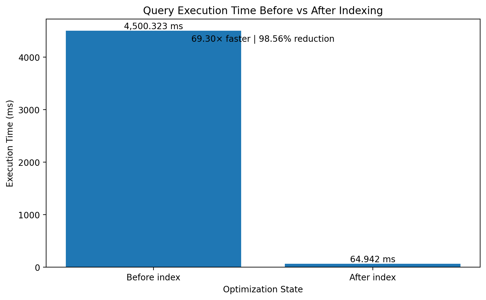

## Query Optimization Results

The performance of a customer search query was measured before and after creating an index on `customer_id`.

| Metric | Before Index | After Index |
|---|---:|---:|
| Execution Time |4,500.323 ms | 64.942 ms |

### Performance Improvement

- **69.30x faster** query execution.
- **98.56% reduction** in execution time.
- Index created: `idx_sales_customer_id`
- Query tested: `customer_id = 5000`

### Benchmark Query

```sql
EXPLAIN ANALYZE
SELECT *
FROM sales
WHERE customer_id = 5000;


### Performance Chart


